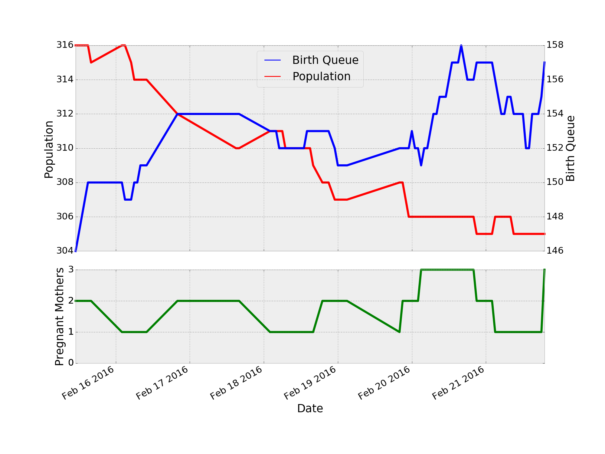

Grabs data from faerytailonline webpage for use in a csv in the following format:

    MM/DD/YY-HH, Population, Birth Queue Size, Pregnant Mothers

where the time is UTC. HH is in 24 hour format

# Requirements

    Python2 or Python3
    Bash
    beautifulsoup4 (python library)
    requests (python library)

# Installation

    sudo apt-get install python3 python3-pip
    sudo pip install beautifulsoup4 requests

# Usage

## scrape_fto.py

    ./scrape-fto.py 

Queries fto and echos the formatted string 

## append_csv.sh

Calls the above python script and appends the output
to a csv and creats headers if emtpy. 
This script should be called by crontab at regular intervals and 
the output csv should be accessable via http

e.g.

        ./append_csv.sh output.csv

A crontab entry might look like

        0 0,12 * * * /dir/append_csv.sh /var/www/fto-stats.csv

which runs the script twice per day at 12AM / 12PM
where `dir` is the directory for `append_csv.sh` AND `scrape_fto.py` 

### truncate_csv.sh

Truncates the result from `append_csv.sh`, to the last 6 months of data to the beginning of the last 6th month. This script is called inside from `append_csv.sh` and creates a csv file with the same name as the output of append_csv in the same directory, with _6months.csv appended to to the end.

### Output

        Date,Population,Birth Queue,Pregnant Mothers
        02/15/16-08,311,152,3

Once the csv is accessable via http, it can be linked into a google doc, 
and graphs can be applied to the data

# fto-graph.py

Graphs the csv data and outputs an image

## Requirements

    matplotlib
    pandas

## Installation

    sudo apt-get install libfreetype6-dev python3-dev
    sudo pip install matplotlib pandas
    (wait forever while it compiles)

## Usage

    ./fto-graph.py example/fto-stats.csv output.png

## Output

